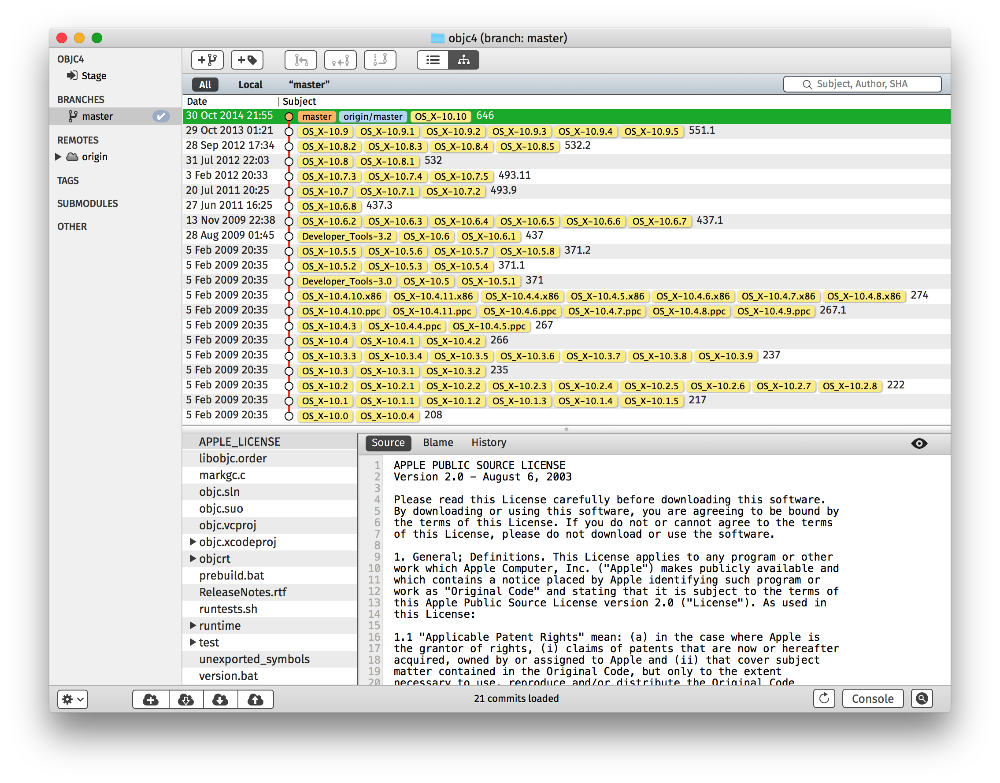

# Tatin

## Create git clones of opensource.apple.com

`tatin.py` is a small-ish script that scraps all the projects from opensource.apple.com, downloads all the tarballs and recreates a git repository.

(Warning: I am a total Python noob. Don’t look if you don’t want to be horrified. On the other hand, pull requests are welcome.)

The repositories are available at 

https://github.com/unofficial-opensource-apple

Apple releases opensource code for four _Products_: Developer Tools, OS X, OS X Server and iOS.
For every _Release_ of these products, they (in theory) also publish the sourcecode of the _Version_ of the opensource _Project_.
There are 509 projects total, listed at http://opensource.apple.com/source/. Some are actually never referenced in a Product. (Like `DarwinInstaller`, of course, or `zsh`, unfortunately.) The source code is made available as tarballs for each version, 5334 in total.

`tatin.py` attempts to recreate a more usable git repository for each of these projects. It 
* downloads all the version tarballs of this project, 
 * creates a new commit for each version
 * adds tags for each Product Release referencing this version.
 * The “Modified-At” returned by opensource.apple.com when requesting the tarballs is _relatively_ coherent after 2010. (The epoch of opensource.apple.com seems to be the 5th of February 2009.) This date is used as the GIT_AUTHOR_DATE and GIT_COMMITTER_DATE. [^git]
 * Additionally, the git user is set to `opensource.apple.com <opensource@apple.com>`. By setting this and the commit/author dates, the commit hashes stay the same when a repository is recreated from zero.
* creates a repository at `github.com/unofficial-opensource-apple/<project>`

Here’s what the objc4 repository looks like:



Or if you’d rather use the CLI:

```
~/Documents/bazar/tatin/objc4 (master) $ git log --pretty=format:"%C(bold)%s %C(dim)%ci%Creset%d"
646 2014-10-30 20:55:50 +0000 (HEAD, tag: OS_X-10.10, origin/master, origin/HEAD, master)
551.1 2013-10-29 00:21:36 +0000 (tag: OS_X-10.9.5, tag: OS_X-10.9.4, tag: OS_X-10.9.3, tag: OS_X-10.9.2, tag: OS_X-10.9.1, tag: OS_X-10.9)
532.2 2012-09-28 15:34:15 +0000 (tag: OS_X-10.8.5, tag: OS_X-10.8.4, tag: OS_X-10.8.3, tag: OS_X-10.8.2)
532 2012-07-31 20:03:32 +0000 (tag: OS_X-10.8.1, tag: OS_X-10.8)
493.11 2012-02-03 19:33:50 +0000 (tag: OS_X-10.7.5, tag: OS_X-10.7.4, tag: OS_X-10.7.3)
493.9 2011-07-20 18:25:33 +0000 (tag: OS_X-10.7.2, tag: OS_X-10.7.1, tag: OS_X-10.7)
437.3 2011-06-27 14:25:00 +0000 (tag: OS_X-10.6.8)
437.1 2009-11-13 21:38:33 +0000 (tag: OS_X-10.6.7, tag: OS_X-10.6.6, tag: OS_X-10.6.5, tag: OS_X-10.6.4, tag: OS_X-10.6.3, tag: OS_X-10.6.2)
437 2009-08-27 23:45:24 +0000 (tag: OS_X-10.6.1, tag: OS_X-10.6, tag: Developer_Tools-3.2)
371.2 2009-02-05 19:35:26 +0000 (tag: OS_X-10.5.8, tag: OS_X-10.5.7, tag: OS_X-10.5.6, tag: OS_X-10.5.5)
371.1 2009-02-05 19:35:26 +0000 (tag: OS_X-10.5.4, tag: OS_X-10.5.3, tag: OS_X-10.5.2)
371 2009-02-05 19:35:27 +0000 (tag: OS_X-10.5.1, tag: OS_X-10.5, tag: Developer_Tools-3.0)
274 2009-02-05 19:35:26 +0000 (tag: OS_X-10.4.9.x86, tag: OS_X-10.4.8.x86, tag: OS_X-10.4.7.x86, tag: OS_X-10.4.6.x86, tag: OS_X-10.4.5.x86, tag: OS_X-10.4.4.x86, tag: OS_X-10.4.11.x86, tag: OS_X-10.4.10.x86)
267.1 2009-02-05 19:35:25 +0000 (tag: OS_X-10.4.9.ppc, tag: OS_X-10.4.8.ppc, tag: OS_X-10.4.7.ppc, tag: OS_X-10.4.6.ppc, tag: OS_X-10.4.11.ppc, tag: OS_X-10.4.10.ppc)
267 2009-02-05 19:35:25 +0000 (tag: OS_X-10.4.5.ppc, tag: OS_X-10.4.4.ppc, tag: OS_X-10.4.3)
266 2009-02-05 19:35:25 +0000 (tag: OS_X-10.4.2, tag: OS_X-10.4.1, tag: OS_X-10.4)
237 2009-02-05 19:35:24 +0000 (tag: OS_X-10.3.9, tag: OS_X-10.3.8, tag: OS_X-10.3.7, tag: OS_X-10.3.6, tag: OS_X-10.3.5, tag: OS_X-10.3.4, tag: OS_X-10.3.3)
235 2009-02-05 19:35:24 +0000 (tag: OS_X-10.3.2, tag: OS_X-10.3.1, tag: OS_X-10.3)
222 2009-02-05 19:35:24 +0000 (tag: OS_X-10.2.8.G5, tag: OS_X-10.2.8, tag: OS_X-10.2.7, tag: OS_X-10.2.6, tag: OS_X-10.2.5, tag: OS_X-10.2.4, tag: OS_X-10.2.3, tag: OS_X-10.2.2, tag: OS_X-10.2.1, tag: OS_X-10.2)
217 2009-02-05 19:35:23 +0000 (tag: OS_X-10.1.5, tag: OS_X-10.1.4, tag: OS_X-10.1.3, tag: OS_X-10.1.2, tag: OS_X-10.1.1, tag: OS_X-10.1)
208 2009-02-05 19:35:23 +0000 (tag: OS_X-10.0.4, tag: OS_X-10.0)
```
